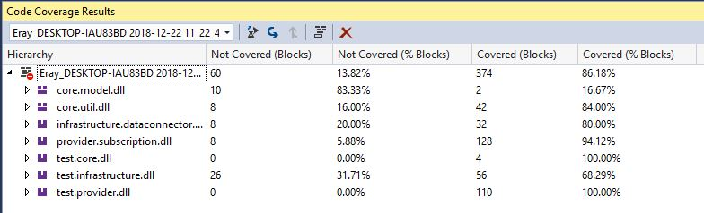
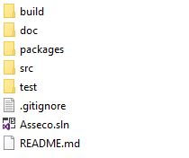
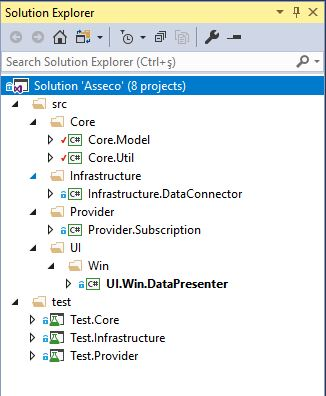

# Asseco Case

### Getting Started

These instructions will help you to provide some insight on the project's architecture as well as deploy and run.
Within the files in the solution, summaries are written on necessary code blocks, classes, methods, and properties.
In order to increase the ease of usage, a short video (mp4 format) can be found within `doc\video` folder.

The projects are implemented as much Unit Testtable as possible. Although there could be more unit tests, current coverage is around 86% according to Visual Studio 2017.

### Used Technologies & Nuget Packages

- Visual Studio 2017
- .NET Framework 4.6.1
- Castle.Windsor v4.1.1
- XUnit v2.4.1
- Moq v4.10.1
- System.IO.Abstractions v3.0.2
- System.IO.Abstractions.TestingHelpers v3.0.2

### Assumptions

1. Only .txt files are used to import. So, OpenDialog only allows .txt files.
2. Maximum file size is set to 5 MB.
3. Exception Logs are only displayed as a Dialog and NOT saved into files.

### Folder Structure

1. **build:** Contains the extracted files after the build process. Debug and Release versions can be found here
2. **doc**: Related document files such as images and testing import data are stored here. You can also find the PDF version of this README.md.
3. **packages**: These are the NuGet packages of the solution
4. **src**: Source files of the solution stored here. When *.sln file is opened, this folder will be displayed in the solution
5. **test**: The unit test projects are in here. Just like **src**: folder, these also will be displayed when *.sln file is opened.

### Solution Structure

1. **Core.Model**: Currently, only exception models are in here. But in a larger project some contracts, enums or entities can be placed here for shared usage purposes.
2. **Core.Util**: Some shared extension classes are stored in there.
3. **Infrastructure.DataConnector**: This project is intended to cover Resource connections like Database, File, etc. Even though currently we use only File connection, this project can easily be extended for MongoDb, Redis or any other data sources.
4. **Provider.Subscription:** Provider's purpose is the use Infrastructure to obtain some raw data and then parse them into manageable objects (like Data Transfer Objects). Currently, there is a FileParser which converts the raw text file content into `Subscription` objects.
5. **UI.Win.DataPresenter:** This is the presentation layer and virtually contains **no logic**. The reason why a `UI` folder is created is to be able to extend for numerous UI's like Console, Web or Mobile applications.
6. **Test.Core:** Core layer unit tests.
7. **Test.Infrastructure:** Infrastructure layer unit tests.
8. **Test.Provider:** Provider layer unit tests.

### Running

You can either run it from Visual Studio or directly from the executable file sent by email.
In order to run it from exe file:
1. Either extract and run the `UI.Win.DataPresenter.exe` file separately sent zip file `Executables.zip` or the same file within 'build/Release' folder.

In order to run it properly from Visual Studio:
1. Set **UI.Win.DataPresenter** as Startup Project and with or without debugging Start 
